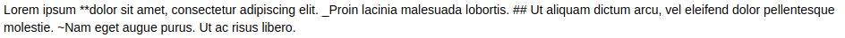

# Exercícios


### Jupyter Notebooks/Markdown 


#### Exercício 1:

Reproduza o seguinte
[README](assets/markdown.pdf)
utilizando `markdown` no Jupyter notebook.


#### Exercício 2:

O `markdown` não possibilita que redimensionemos a imagem usando a sintaxe
``.  Pesquise uma maneira de inserir a seguinte imagem
e redimensioná-la no jupyter notebook. 


#### Exercício 3:

Como escrever (utilizando uma célula `markdown`) em texto simples os símbolos
utilizados pela sintaxe ( `*, #, _ **`)?

Imagem exemplo:


#### Exercício 4:

Instale o a ferramente `matplotlib` usando o `conda` utilizando uma célula do
`jupyter notebook`.  **Dica 1:** insira `-y` no final do comando de instalação
para que ele não espere sua confirmação para instalação.

**Dica 2:** Pode ser necessário reiniciar o `kernel` para que o pacote
instalado seja identificado pelo `jupyter`. Para fazê-lo: aba superior **Kernel
->  Restart**.

Execute o seguinte trecho de código no `jupyter notebook`:


```
import matplotlib
import matplotlib.pyplot as plt
import numpy as np

# Data for plotting
t = np.arange(0.0, 2.0, 0.01)
s = 1 + np.sin(2 * np.pi * t)

fig, ax = plt.subplots()
ax.plot(t, s)

ax.set(xlabel='time (s)', ylabel='voltage (mV)',
       title='About as simple as it gets, folks')
ax.grid()

plt.show()

```

Se precisar, instale utilizando `conda` os pacotes que estiverem faltando no
ambiente.

Obs.: Em módulos futuros, será explicado como utilizar a lib `matplotlib`.

#### Exercício 5

Utilize o repositório [profiles](https://github.com/ai2-education-fiep-turma-3/resident-profiles), criar um novo diretório no formato `nome-sobrenome` (utilizar último sobrenome - não utilizar letras maiúsculas). Criar um novo `README.md` no seu diretório contendo o seu perfil (como uma espécie de mini CV) utilizando `Markdown`.

