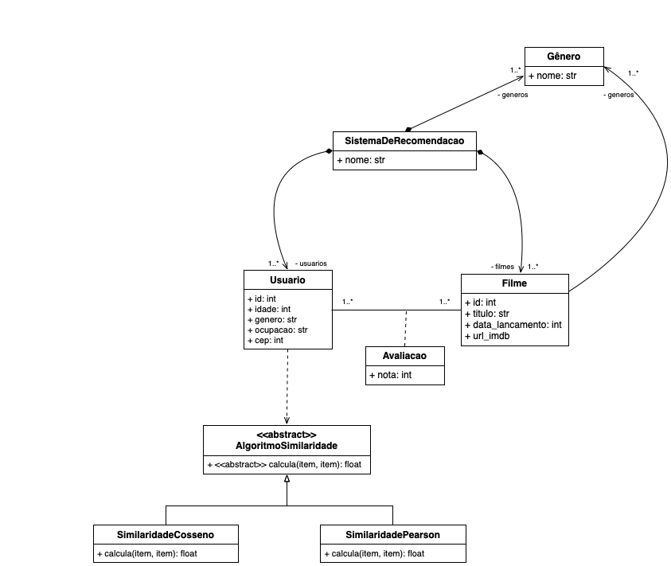
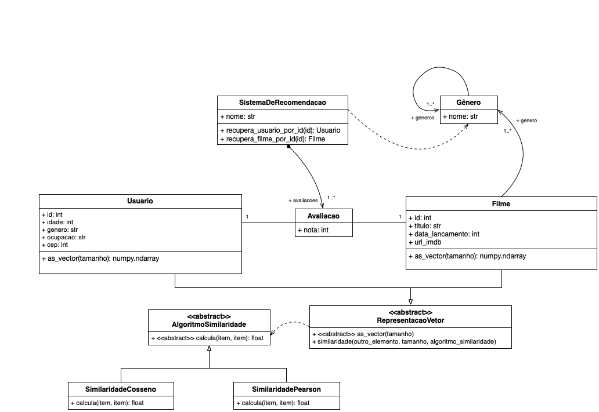

# Exercícios


### Projeto de Classes 

Para esse conjunto de exercícios vamos utilizar o conjunto de dados
disponibilizado no dataset [MovieLens
100k](https://grouplens.org/datasets/movielens/100k/)


O conjunto de dados do MovieLens foi coletados pelo GroupLens Research Project
na Universidade de Minnesota.
 
Este conjunto de dados consiste em:
* 100.000 classificações (1-5) de 943 usuários em 1.682 filmes.
* Cada usuário classificou pelo menos 20 filmes.


Continuando o que foi feito em sala (disponível no diretório
[source](../../src/aula8)), pede-se que sejam criadas as classes:

* `AlgoritmoSimilaridade`: classe abstrata que possui um método (abstrato):
  `calcula()`. Esse método recebe dois arrays **Numpy**;
* `SimilaridadeCosseno`: implementação do método de [Similaridade do
   Cosseno](https://en.wikipedia.org/wiki/Cosine_similarity);
* `SimilaridadePearson`: implementação do método da [Correlação de
   Pearson](https://pt.wikipedia.org/wiki/Coeficiente_de_correla%C3%A7%C3%A3o_de_Pearson);

A classe `Usuario` deve ter uma operação chamada similaridade que recebe como
parâmetro outro usuário e uma instância de um `AlgoritmoSimilaridade`.


A hierarquia de classes deve refletir o que consta no seguinte diagrama de
classes UML:



### Bonus

Implementar a seguinte refatoração na arquitetura proposta:


Alguns detalhes:
* A classe `RepresentacaoVetor` possui um método abstrato `as_vetor` e um
  método concreto `similaridade` cuja implementação é a seguinte:
```python
def similaridade(self, outro_elemento, tamanho, algoritmo_similaridade):
  vetor1 = self.as_vector(tamanho)
  vetor2 = outro_elemento.as_vector(tamanho)
  return algoritmo_similaridade.calcula(vetor1,vetor2)
```

* A classe `Genero` é autoreferênciada, o que significa que ela possui um
  dicionário de 19 elementos do tipo `Genero` que representa os possíveis
  gêneros de filmes armazenados por `genero_id`. Esse dicionário é um atributo
  da classe `Genero` e não de suas instâncias. O conteúdo desse dicionário é
  preenchido na operação `carregar_generos_do_arquivo()` na classe
  `SistemaDeRecomendacao`.

* A classe `SistemaDeRecomendacao` possui dois métodos que ajudam na
  recuperação de um usuário ou filme, dado seu identificador;


